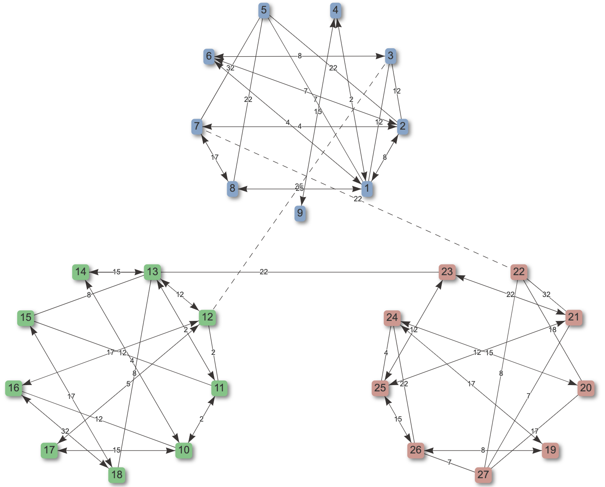
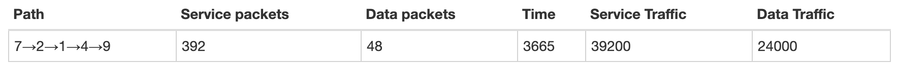
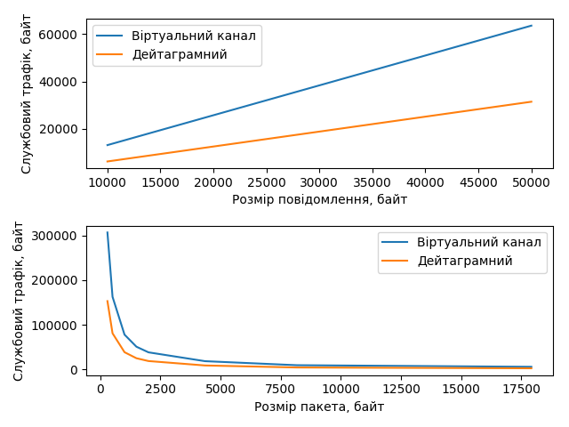
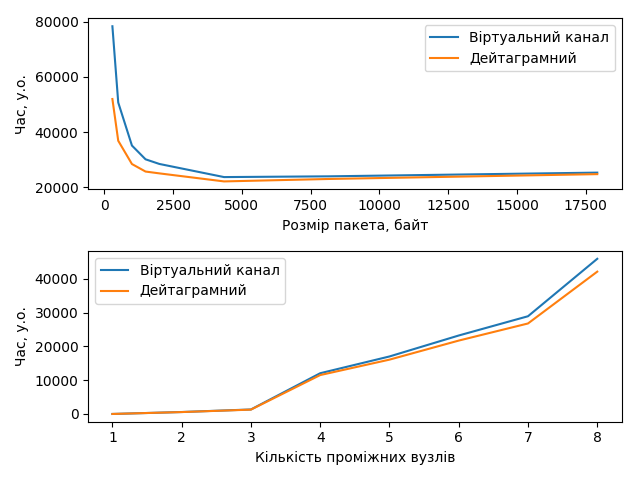

# Network simulation

This application simulates and visualises network routing and message transmission in the network of defined topology.

## Prerequisites

1. Python 3.6.8 
2. `pip` 19.1.1
3. `make`

## Getting started

To start the application, run

```bash
make run
```

This will download virtualenv and create a new local environment if you don't have them, install needed dependencies and run the server.

Visit [http://localhost:5000](http://127.0.0.1:5000) in your browser to use the service UI.

## Functionality

### Start up
The service creates an arbitrary network topology according to pre-defined configurations.



### Topology manipulations
You can add nodes and edges by using corresponding buttons in the top left corner.

You can delete nodes and edges by selecting them and clicking "Delete" button.

You can change edge type (duplex, half-duplex) by double-clicking the edge.

### Routing
You can inspect node's routing table by double-clicking the node.

You can simulate message transmission between two nodes by using the top right button. You can choose message and packet size, as well as, the transmission type (virtual circuit mode, datagram mode) in the modal window. The application will calculate the route, number of service and data packets sent, time, service traffic, and data traffic of such transmission.



### Plots
You can generate a few plots available in Ukrainian.

#### Service traffic
**GET request to `/service-traffic`** will generate plots describing *service traffic to message size* and *service traffic to packet size* relations.



#### Time
**GET request to `/time`** will generate plots describing *transmission time to packet size* and *transmission time to number of intermidiary nodes* relations.


